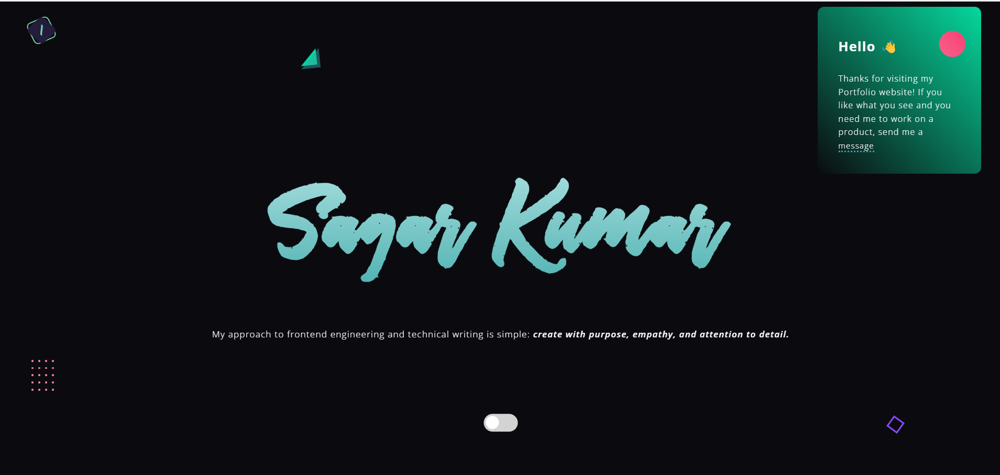

# My Portfolio

This is a **My Portfolio ** designed using **HTML**, **CSS (SCSS)**, **JavaScript**, and **GSAP**. This portfolio showcases my skills, projects, and contact information with a modern design and interactive animations.

## Features

- **Modern Design**: Clean and professional layout to highlight your expertise.
- **Interactive Animations**: Smooth and engaging animations powered by **GSAP**.
- **Responsive Design**: Optimized for viewing on desktops, tablets, and mobile devices.
- **Dynamic Content**: JavaScript is used to add interactivity and enhance the user experience.

## Tech Stack

- **HTML**: Structure of the website.
- **CSS (SCSS)**: Styling and animations with modular and maintainable code.
- **JavaScript**: Interactivity and logic for dynamic user experience.
- **GSAP (GreenSock Animation Platform)**: Advanced animations for smooth transitions and effects.

## Live Demo

Check out the live version of the portfolio: [My Portfolio](https://panditsagar.github.io/My-Portfolio)

## Screenshots

### Homepage

